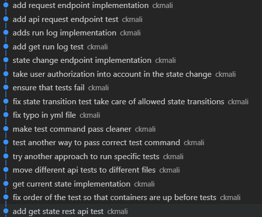
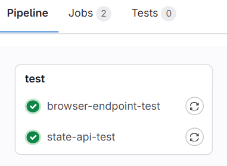
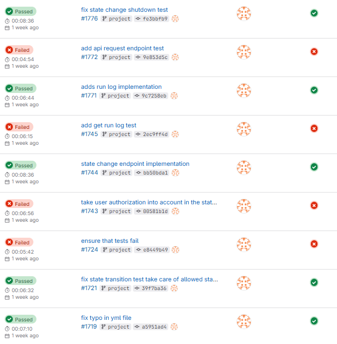
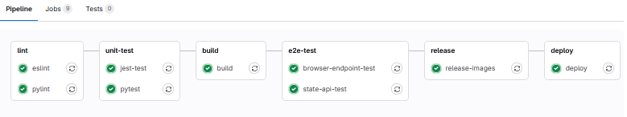
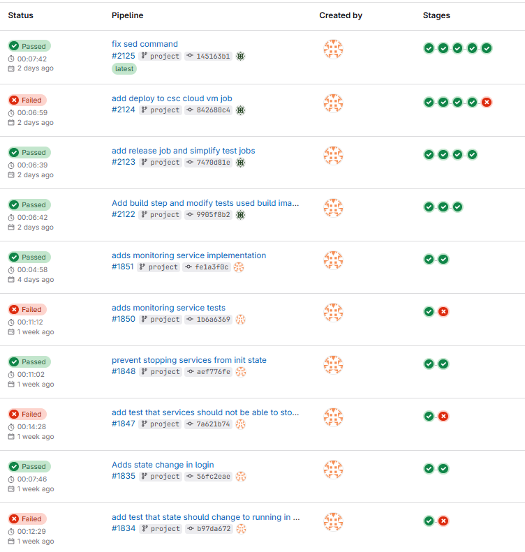

<div style="text-align: right; line-height: 1;">
  <p style="margin: 0;">Tampere University</p>
  <p style="margin: 0;">matti.linna@tuni.fi</p>
  <p style="margin: 0;">Matti Linna</p>
  <p style="margin: 0;">19.1.2025</p>
</div>

# COMP.SE.140 Project End Report

| Version | Date       | Description                                                            |
| ------- | ---------- | ---------------------------------------------------------------------- |
| 0.1     | 2025-01-12 | Initial draft of the project end report                                |
| 1.0     | 2025-01-19 | Add more descriptions and some minor improvements for final submission |

## Instructions for the teaching assistant

### Implemented optional features

- Unit tests for service1 and service2, also comprehensive e2e tests
- Static analysis step for pipeline (lint) with Pylint and ESlint
- Monitoring and logging for troubleshooting
- Deployment to CSC cloud Pouta service VM
- **Extra:** Utilized Gitlab Container Registry to store artifacts (build Docker images) and release phase to pipeline

### Instructions for examiner to test the system.

The application is deployed CSC cloud Pouta service VM to address `86.50.228.123`. `NOTE!` that if you press `stop` button from browser or change application state to `SHUTDOWN` the containers will be stop and the application cannot be then anymore reach from cloud before it's deployed again. Registered GitLab runner is running on my PC so if you wan't to get application deployed again to VM you need to register your own runner and then go to the latest successfull pipeline and trigger deploy job from here (you maybe need also to ask permissions from me to do that). Still I recommend that you test those stop or shutting down functionality locally see [local testing section](#local-testing). If you still stop the containers and want to get those back in running, please contact me.

#### Browser application

Browser application can be reach from `86.50.228.123:8198`. You can login to application with credentials (credentials can be also found from `login.txt` from the repository's root):

- username: nginx
- password: nginx

After successfull login you can press request button to get different information from services. Request can be done only if the application is in running state. If you are going to use stop button, see the note above.

#### State rest api

State rest api is available from `86.50.228.123:8197`. Following end points can be used:

- `GET /state` returns the application state and can be tested for example with command `curl 86.50.228.123:8197/state -H "Accept: text/plain"`
- `PUT /state` endpoint can be used to change application state. With this endpoint only authenticated users can change the state. This can be tested for example with command `curl 86.50.228.123:8197/state -u nginx:nginx -X PUT -d "PAUSED" -H "Content-Type: text/plain" -H "Accept: text/plain"`
- `GET /request` returns the service information and can be tested for example with command `curl 86.50.228.123:8197/request -H "Accept: text/plain"`
- `GET /run-log` returns the information about state changes and can be tested with command `curl 86.50.228.123:8197/run-log -H "Accept: text/plain"`

Only the state changes needs authentication to actually change the state but other endpoints works without it. There should be descriptive error messages if some operation fails due to authorization.

#### Monitoring service

Monitoring page is available from `86.50.228.123:8098` there you can see the application start time in Finland's time zone (Europe/Helsinki) and number of requests to application. Requests to monitoring service are not counted into number of requests (that could be easily added with the ready middleware but there was no requirement for that). When the application state changes to `INIT`, the start time and request count are not reset. This is because the purpose of the monitoring service is to monitor the overall requests to the application and its actual start time. This choice was made to align with the monitoring service's purpose. If resetting the start time and request count were necessary, it could be done with only two lines of code, but I think there was no clear requirement what needs to happen for monitoring service. `!NOTE`: If you access to browser application depending on your browser the browser is actually making more than one request when you are asking HTML page. Authentication to monitoring service is not needed because there was no requirement for that. Monitoring page is polling new available data from backend every 2 seconds so the request count is not instantly updating.

### Local testing

Application can be fully tested locally. This section contains the information to test apllication locally. There are also instructions how to do linting and run unit and e2e tests locally.

#### Application testing

Start application locally with docker compose:

```
$ git clone -b project https://compse140.devops-gitlab.rd.tuni.fi/ckmali/comp.se.140-project.git
$ cd <created folder>
$ docker-compose build –-no-cache
$ docker-compose up -d
```

See instructions above about which endpoints can be tested. The only thing that you need to change is to replace cloud VM address with localhost. So for example you can reach the browser application from address `localhost:8198`.

#### Linting

Linting jobs for both TypeScript and Python runs automatically in GitLab pipeline. Those can be tested locally also with following steps (NOTE! depending on your node package manager system the steps might vary).

**ESlint**

```
cd <root-of-the-project>
npm install @eslint/js@9.17.0 eslint@9.17.0 globals@15.14.0 typescript-eslint@8.18.2
npx eslint2
```
<div class="page-break"></div>

**Pylint**

```
cd service2
python -m venv venv
source venv/bin/activate
pip install -r requirements.txt
pip install pylint==3.3.3
pylint *.py
```

#### Unit tests

For service1 there are unit tests made with Jest test framework. These can be run locally with following steps:

```
cd service1
npm ci
npm run test
```

Service2 uses Python. There are unit tests made with Pytest for that service also and those can be run with the following steps:

```
cd service2
python -m venv venv
source venv/bin/activate
pip install -r requirements.txt
pytest
```

#### E2E tests

E2E tests can be run also locally with docker compose using the following steps separately for browser and state API endpoints:

**Browser endpoint tests**

```
cd <root-of-the-project>
docker-compose up -d --build
export TEST_COMMAND="npm run test:browser" && docker-compose -f docker-compose-test.yml up --build --abort-on-container-exit --exit-code-from test-container
```

**State REST API endpoint tests**

```
cd <root-of-the-project>
docker-compose up -d --build
export TEST_COMMAND="npm run test:state-api" && docker-compose -f docker-compose-test.yml up --build --abort-on-container-exit --exit-code-from test-container
```

Basically with `TEST_COMMAND` environmental variable you can configure which tests are run. That variable is also used in pipeline to run different tests.

### Development platform

Following development platform was used. Windows subsystem for linux was also utilized to test different endpoints with linux like commands.

- Hardware: HP Spectre x360 Convertible 13-ae0xx laptop
- CPU architecture: AMD64
- Operating system: Windows 11 Home
- Docker version: 25.0.3
- Docker Compose version: v2.24.6-desktop.1
- WSL-versio: 2.1.5.0

## Description of the CI/CD pipeline

The CI/CD pipeline of this project contains the forllowing steps: lint, unit-test, build, e2e-test, release and deploy steps. This section contains information about those steps and there is also brief section about used version management system and used practices during the development.

### Version management

Git was used in version control. Project started with the existing implementations for nginx, service1 and service2 and those were stored to [GitHub repository](https://github.com/masaoskari/COMP.SE.140-exercises). Second remote to course [Gitlab repository](https://compse140.devops-gitlab.rd.tuni.fi/ckmali/comp.se.140-project.git) was added at the beginning of the project and `project` branch was made. Project branch was mainly the branch where the development happened because there was only one developer so there were no need for other branching. Instead of some test branches were used during development. For example when configuring the deployment job different branches were used to test different approaches. At the end of the project the ready source code was added also to `main` branch.

Development was made by obeying Test-driven development (TDD). Development then roughly followed the following steps:

1. Test for the new feature was implemented
2. Ensured that the test fails (also in pipeline)
3. The new feature was implemented
4. Tested that the implementation pass the implemented test.

TDD obeying can be seen from the version history and its commit messages (Figure 1). Same information can be basically seen from [pipeline runs](https://compse140.devops-gitlab.rd.tuni.fi/ckmali/comp.se.140-project/-/pipelines?page=1&scope=all&ref=project) for `project` branch.

<div style="text-align: center;">
  <figure>
    
    <figcaption>Figure 1: Commit message log from TDD phase.</figcaption>
  </figure>
</div>

### Linting

TypeScript and Python were used as an programming language of this project in service1, service2 and gateway and the pipeline is configured to lint TypeScript codes with ESlint and Python codes with Pylint. Default configurations for both ESlint and Pylint were used. Pylint is not needing any external configuration file and ESlint configuration file was made automatically with command `npx eslint --init`. By using default configuration files, the community's best practices were followed.

### Building

The application is build with Docker and Docker-in-Docker (DinD) that enables to run Docker containers inside a docker container that is done with using CI/CD [service](https://docs.gitlab.com/ee/ci/services/) keyword. The build images are tagged with the commit hash and stored to GitLab Container Registry if the build succeed.

To get DinD working in registered GitLab runner the runner needs to use privileged mode. GitLab also suggest that DinD should be used with TLS enabled. To use DinD with TLS enabled the GitLab runner must be configured correctly for that. See more details from [instructions](https://docs.gitlab.com/ee/ci/docker/using_docker_build.html#use-docker-in-docker). For example I configured my runner with command:
````
docker run --rm -it -v gitlab-runner-config-tls:/etc/gitlab-runner gitlab/gitlab-runner:latest register \
  --non-interactive \
  --url "https://compse140.devops-gitlab.rd.tuni.fi" \
  --registration-token <TOKEN> \
  --executor "docker" \
  --description "TLS docker runner" \ 
  --docker-image docker:27.4.1 \
  --docker-privileged \
  --docker-volumes "/certs/client" \
  --tag-list "docker-runner"
````

### Testing

Before the building phase automated unit tests are made for service1 and service2. Unit tests are using Pytest and Jest frameworks' mocks to test different features of the services without relying the specific OS. The unit tests are run before build step and if they success the pipeline is continuing to that step. Unit tests are located in the folders within each service.

After the build job e2e-tests are run from the `tests`-folder. These tests are run against similar environment that the production environment is. The build images in build step are used to set up the application with Docker Compose and Jest testing framework with supertest is utilized to test how the application looks to outside world. Tests are divided into `browser-endpoint.tests.ts` and `state-rest-api.test.ts` tests. The browser endpoint tests check the browser endpoints for the Nginx application created in exercise 4 on port 8198, and also the monitoring endpoints on port 8098. The state REST API tests check the endpoints available on port 8197. The tests are divided into separate jobs so that we can test the stop or shutdown endpoints.

### Packing (release)

If the previous end-to-end tests pass, the build images from the build step are released with the `latest` tag to GitLab's Container Registry.

### Deployment

The deployment job deploys the application (built Docker images) to a CSC cloud Pouta services VM. The VM uses the Ubuntu 22.04 operating system, and Docker and Docker Compose are installed on the VM. To enhance security, a user other than the default user is configured to perform the deployment steps.

Deployment step uses `scp` to move correct Docker Compose files to VM and `ssh` to make deployment operations from the VM like pulling the Docker images from the GitLab Container Registry and setting up the application. Needed secrets are configured to repository's variables, using the best practices.

### Operating & Monitoring

Applications monitoring is implemented to be `gateway` component's feature. That implementation is done staight to that component but could be easily moved to another microservice so that the traffic still goes through the gateway.

Monitoring page is available from address and port `86.50.228.123:8098` or if the application is deployed locally from `localhost:8098`. Monitoring service is showing the applications start time and request count.

## Example runs of the pipeline

Development was made in test-driven manner and when the applications features were under development the pipeline contained only test phase. The test job was only used during development to save limited laptop computing resources (because the GitLab runner runs in the same machine). This approach made development more efficient and faster by avoiding the need to run long pipeline sequences to see the results, which would otherwise slow down the laptop. From Figure 2 the pipeline runs in the application development can be seen. In the log we can see for example that the test driven development method revealed bug in the pipeline configuration because when the new test was made it didn't fail even if there was no actual development for that feature. That can be seen from the log where the commit is `ensure that tests fail`.

<div style="text-align: center;">
  <figure>
    
  </figure>
  <figure>
    
    <figcaption>Figure 2: Pipeline jobs and its runs in application development phase.</figcaption>
  </figure>
</div>

When the features were developed the application pipeline was developed further to contain steps lint, unit-test, build, e2e-test, release and deploy that are visible from Figure 3.

<div style="text-align: center;">
  <figure>
    
  </figure>
  <figure>
    
    <figcaption>Figure 3: Pipeline jobs and runs with all required stesps.</figcaption>
  </figure>
</div>

<div class="page-break"></div>

## Reflections

The main learning of this project to me was the knowing of the how GitLab pipelines are run with the runners. I have done in my work many pipeline configurations but haven't really known the infrastructure behind the pipelines. I also learned how to use Docker-in-Docker and I think my pipeline configuration skills also improved especially when needed to configure continuous deployment.

I think the hardest thing to me was to configure the e2e tests so that those are really testing the application how it's visible to outside world. Got many difficulties with Docker-in-Docker and the networking problems like how the test container can access to different endpoints. But now when it's done I think that was quite good learning experience and the e2e tests are working quite nice. I choose Jest to be my testing framework but I could have utilized Cypress so that I could be able to do the UI tests also but that was not again the requirement, so I think Jest was good choise for this purpose. Another idea for this kind of e2e tests would have been to utilize [testcontainers framework](https://testcontainers.com/) in testing but for better learning outcomes I think my "under the hood" implementation is better.

I spend quite much time for planning how I will implement the API gateway for the application so that I can keep the nginx load balancing features and authentication but at the end I think I got quite clean solution for that by extending the nginx with node server.

I would have separated, for example, the service2 test framework packages into another requirements file so that they do not get into the production environment. However, due to limited time and resources, this was not implemented but in real applications should be fixed.

## Amount effort (hours) used

70 h
